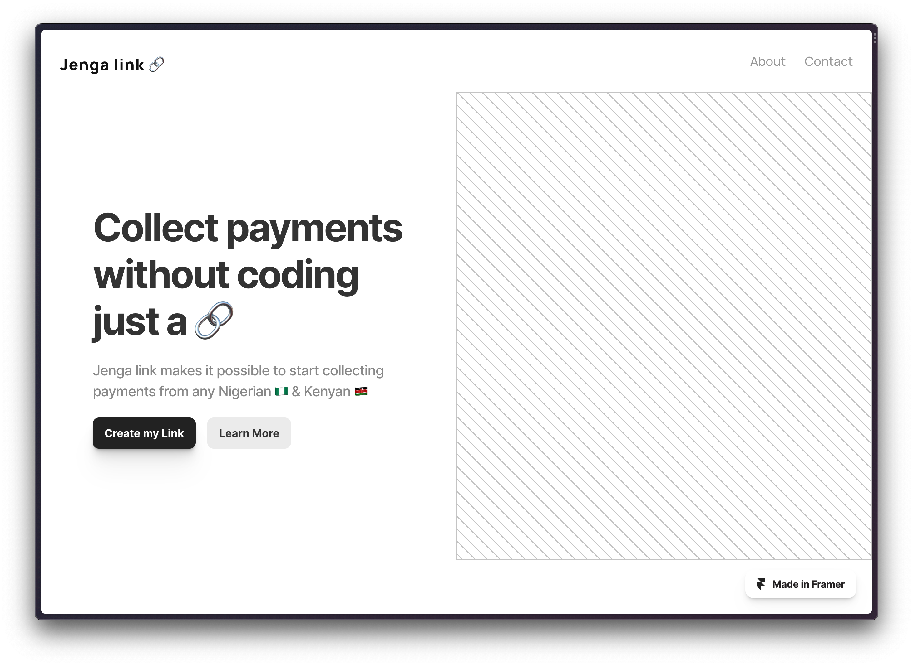

# 🔗 Jenga Link

Co-authored with <a href="https://github.com/kkipngenokoech">kkipngenokoech 💪🏽</a>

# Landing Page
</img>


# Backend
We used 
- Gofiber for routing
- In memory hash maps as DB's 😅 lol
- All the business login is in the `shida` folder

To run the backend 🫡
```bash
go run backend/main.go
```


# Frontend
Make with Nextjs
- For UI stuff we used Material UI
- For request stuff good all `fetch` was enough

To run the frontend 🧑‍🎨
```bash
cd frontend
yarn
yarn dev
```


### Landing
Made with Framer 👍 
